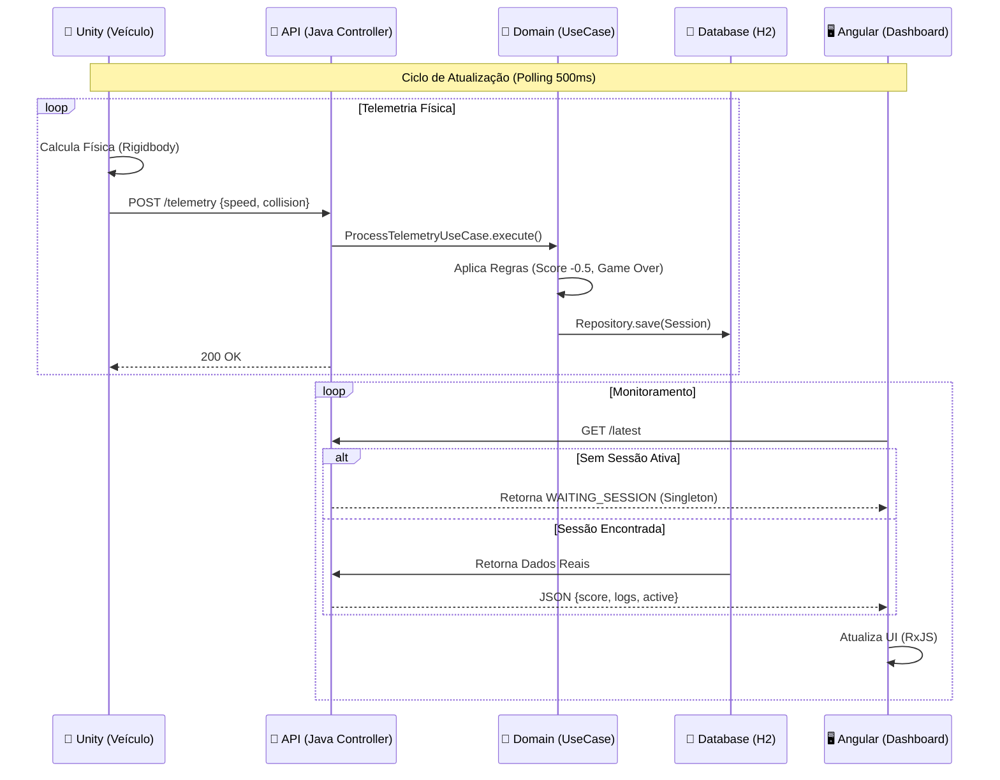

# 🏗️ OperateOS - VR Industrial Training Platform

<!-- Badges de Tecnologias -->


> **Plataforma Enterprise de Treinamento Imersivo com Gêmeos Digitais.**
> Solução desenvolvida durante o **HackTown 2025** focada em arquitetura escalável, integração IoT e experiência do usuário em tempo real.

---

## 📋 Índice

1. [Visão Geral](#-visão-geral)
2. [Arquitetura da Solução](#-arquitetura-da-solução)
3. [Stack Tecnológica](#-stack-tecnológica)
4. [Estrutura do Monorepo](#-estrutura-do-monorepo)
5. [Desafios Técnicos & Soluções](#-desafios-técnicos--soluções-war-stories)
6. [Guia de Instalação](#-guia-de-instalação-e-execução)
7. [Squad](#-squad-de-alta-performance)

---

## 🎯 Visão Geral

O **OperateOS** resolve o problema do alto custo e risco no treinamento de operadores de máquinas pesadas. Através de um ambiente seguro (VR/Unity), simulamos cenários de risco e capturamos telemetria em tempo real para um backend analítico, exibindo métricas de performance e alertas críticos em um dashboard de comando.

**Fluxo de Valor:**

1.  **Simulação:** O motorista opera o veículo no Unity 3D (Gêmeo Digital).
2.  **Processamento:** A física (velocidade/colisão) é enviada via REST para o Java.
3.  **Análise:** O Backend aplica regras de negócio (DDD) e penalidades.
4.  **Visualização:** O Instrutor monitora o status "Live" no Angular.

---

## 🧩 Arquitetura da Solução

Utilizamos uma abordagem **Híbrida (IoT + Web)**, onde o Unity atua como um dispositivo IoT enviando pulsos de dados para uma API Stateless.

### Fluxo de Telemetria (Diagrama de Sequência)



---

## 🛠 Stack Tecnológica

### 1\. Backend Core (Cérebro)

- **Linguagem:** Java 17.
- **Framework:** Spring Boot 3.3 (Web, Data JPA).
- **Design:** Clean Architecture + DDD Lite.
  - _Domain:_ Entidades ricas (`TrainingSession`) isoladas de frameworks.
  - _Infra:_ Controllers e Repositórios segregados.
- **Banco de Dados:** H2 In-Memory (Configurado com `ddl-auto=update` para agilidade no MVP).

### 2\. Frontend Dashboard (Visão)

- **Framework:** Angular 18+ (Standalone Components).
- **UI Lib:** Angular Material 3 (Custom Theme).
- **Estilo:** SCSS com arquitetura "Fail-Safe" (Definição manual de paletas Dark Mode).
- **Reatividade:** RxJS (`switchMap`, `polling`, `retry`).

### 3\. Simulação (Gêmeo Digital)

- **Engine:** Unity 6 / 2022 LTS.
- **Linguagem:** C\# (MonoBehaviour).
- **Rede:** `UnityWebRequest` com Coroutines para não bloquear a thread de física.
- **Física:** Nvidia PhysX (Rigidbody Constraints para estabilidade).

---

## 📂 Estrutura do Monorepo

```bash
hackathon-workdb-vr/
├── operateos-backend/        # Spring Boot Application (Java)
│   ├── src/main/java/.../core/      # Regrs de Negócio (Puro Java)
│   └── src/main/java/.../infra/     # Frameworks (Spring/JPA)
│
├── operateos-dashboard/      # Angular Application (Web)
│   ├── src/app/core/         # Services & Models
│   ├── src/app/features/     # Dashboard Component
│   └── src/styles.scss       # Design System Global (Manual Palette)
│
├── OperateosSim/             # Unity Project (VR/3D)
│   ├── Assets/Scripts/       # C# Network & Physics logic
│   └── Assets/Scenes/        # Cenário 3D
│
└── .gitignore                # Configuração crítica para ignorar Library/Node_Modules
```

---

## ⚔️ Desafios Técnicos & Soluções (War Stories)

Durante os 4 dias de Hackathon, enfrentamos e superamos bloqueios críticos de nível Enterprise:

### 🔴 1. O "Apagão" do Build Frontend (SASS Error)

- **O Problema:** A migração para Angular Material 18/19 alterou a API de temas. Variáveis nativas como `mat.$indigo-palette` e `$azure-palette` pararam de ser exportadas ou não existiam, quebrando o build com o erro crítico `Undefined variable`.
- **A Solução (Clean Arch):** Abandonamos a dependência de variáveis internas da biblioteca. Implementamos uma **Definição Manual de Paletas (Hexadecimal)** diretamente no `styles.scss`. Isso "blindou" o projeto contra atualizações futuras e garantiu a identidade visual Dark Mode Industrial sem depender de _magic strings_.

### 🟡 2. O Efeito "Estroboscópico" (Flickering ID)

- **O Problema:** O Dashboard piscava e mudava o ID do usuário a cada segundo enquanto aguardava conexão do Unity.
- **A Causa:** O Backend criava uma nova instância de `TrainingSession` (gerando um novo UUID) a cada requisição de polling quando o banco estava vazio.
- **A Solução (Pattern):** Implementamos o **Padrão Singleton** no Controller Java (`static final WAITING_SESSION`). O objeto de "Espera" passou a ser único na memória da JVM, estabilizando a renderização do Frontend e reduzindo a pressão no Garbage Collector.

### 🟣 3. O Bloqueio do GitHub (Large File Storage)

- **O Problema:** O Git rejeitou o push devido a arquivos de cache do Unity (`Library/*.so`) maiores que 100MB, mesmo com o `.gitignore` configurado (os arquivos já estavam "staged" em commits anteriores).
- **A Solução (DevOps):** Executamos uma limpeza profunda de cache (`git rm -r --cached .`) e reestruturamos o `.gitignore` para bloquear explicitamente pastas de build do Unity em subdiretórios (`OperateosSim/Library`), permitindo um deploy leve apenas com o código-fonte.

---

## 🚀 Guia de Instalação e Execução

Para rodar o sistema completo, você precisará de 3 terminais/janelas abertas.

### Pré-requisitos

- Java JDK 17+
- Node.js 18+ & Angular CLI (`npm i -g @angular/cli`)
- Unity Hub & Editor

### Passo 1: Iniciar o Backend (Cérebro)

```bash
cd operateos-backend
# Via Maven Wrapper (Windows)
./mvnw spring-boot:run
```

_Aguarde aparecer:_ `Tomcat started on port 8080`.

### Passo 2: Iniciar o Frontend (Dashboard)

Abra um novo terminal:

```bash
cd operateos-dashboard
npm install
ng serve
```

_Acesse:_ `http://localhost:4200` no seu navegador. Você verá o status **"AGUARDANDO..."**.

### Passo 3: Iniciar a Simulação (Unity)

1.  Abra o **Unity Hub**.
2.  Adicione o projeto na pasta `OperateosSim`.
3.  Abra a cena em `Assets/Scenes/SampleScene.unity`.
4.  Aperte o **Play ▶️**.

**Teste de Sucesso:**

1.  Dirija o veículo (Setas/WASD).
2.  Bata em um obstáculo vermelho.
3.  O Dashboard no navegador deve ficar **VERMELHO** instantaneamente com o alerta de colisão.

---

## 🏆 Squad de Alta Performance

| Membro                 | Função              | Foco Principal                               |
| :--------------------- | :------------------ | :------------------------------------------- |
| **Pedro Paulo (Lead)** | Arquiteto & Backend | Java Core, Integração, Resolução de Crises   |
| \*\*\*\*               | Unity Developer     | Física 3D, C\# Scripting, Otimização de Rede |
| \*\*\*\*               | Frontend Eng.       | Angular, RxJS, UX/UI Material Design         |
| \*\*\*\*               | DevOps/Infra        | Git Flow, Banco de Dados, Documentação       |
| \*\*\*\*               | Product Owner       | Regras de Negócio, Validação QA, Pitch       |

---

> _"A complexidade técnica foi absorvida pela integração robusta entre o Backend Java e a Simulação Física, permitindo que o Frontend servisse como uma janela tática crítica para a operação."_ — **OperateOS Team**

```

```
